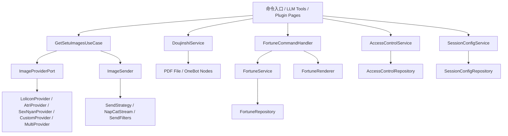

# 架构全景

## 分层结构

项目采用 DDD 分层，目录职责固定：

```text
src/
  domain/          # 实体、值对象、领域规则
  application/     # 用例、DTO、应用服务与端口接口
  infrastructure/  # 配置、持久化、provider、sender、AstrBot 适配
  shared/          # 配置模型、日志、发送缓存
pages/             # Plugin Pages 前端
templates/         # 运势卡片 HTML 模板与字体
tests/             # 单元与集成测试
```

## 启动结构

- `main.py`
  - 插件生命周期装饰器
  - 聊天命令入口和路由
  - LLM tool 注册
  - 不承载业务逻辑编排

- `src/infrastructure/astrbot/`
  - 命令处理器（`commands/setu.py`、`commands/fortune.py`、`commands/session_config.py`）
  - 随机本子服务（`doujinshi/service.py`）、统一可恢复撤回调度器（`sending/revoke_scheduler.py`）与 PDF 文件发送器（`sending/doujinshi_sender.py`）
  - 配置加载与自愈
  - Web API 注册
  - 运势渲染器

`main.py` 负责把 AstrBot 生命周期和命令接进来，`infrastructure/astrbot/` 负责具体适配。业务逻辑在 `application/` 和 `domain/`，不反向侵入入口。

## 核心运行链路

### 1. Setu 图片获取与发送

1. 命令或 LLM tool 触发 → `GetSetuImagesUseCase`
2. 用例通过 `ImageProviderPort` 获取图片 URL，并在下载暂时失败时按 `max_replenish_rounds` 对同一 URL 做确认重试
3. `ImageSender` 按策略发送：直接发送 / 合并转发 → 可选 NapCat 本地 `file://` 直通 → 确认失败后 NapCat 流式或 HTML 卡片 fallback → Docx 封装
4. 发送接口超时或 OneBot/NapCat 类适配器未返回 message id 时标记为可能仍在送达，不立即触发 fallback，避免延迟送达后重复发图
5. 发送结果通过 `resolve_message()` 生成可配置提示
6. 缓存命中时复用本地文件，降低内存压力
7. 自动撤回内容含 `setu`、命中撤回范围且拿到 `message_id` 时，统一撤回调度器将任务写入 `revoke_tasks.json`，重启后按原到期时间调用 OneBot `delete_msg`

### 2. Fortune 运势生成

1. 命令或 LLM tool 触发 → `FortuneCommandHandler`
2. `FortuneService` 查询或生成今日运势记录
3. 有缓存图片时直接复用；否则获取背景、渲染模板、缓存卡片
4. 渲染失败降级为纯文本
5. 自动撤回内容含 `fortune` 时，OneBot 发送结果会登记到统一可恢复撤回队列

### 3. 随机本子 PDF

1. `/随机本子 [标签...]` 与“来份标签本子”通过 `SetuCommandHandler` 复用 Setu 访问控制和标签解析
2. `DoujinshiService` 将每个解析后的标签作为重复 `tag` 参数调用随机本子 API，校验响应并按页图顺序写入 PDF
3. `build_doujinshi_file_chain()` 根据平台构造消息：OneBot/NapCat 使用包含 `File` 的 `Nodes` 合并转发；上游实际提供 `title` / `url` 时，按顺序追加对应的文本节点，缺失字段不造占位节点；其他平台使用普通 `File`
4. 自动撤回内容含 `doujinshi` 且 OneBot 群聊启用时，`DirectSendStrategy` 通过原始合并转发 action 取得 `message_id`，统一撤回调度器立即持久化消息任务
5. 所有新的消息撤回任务共同写入 `StarTools.get_data_dir()` 返回的运行目录；插件重启后按原绝对到期时间调用 OneBot `delete_msg`。合并转发附件不依赖 `get_group_root_files`，因为 NapCat 可能不会将其作为可删除的群文件返回
6. PDF 写入同一插件运行目录，供 AstrBot 文件发送链路读取

### 4. 访问控制

1. 命令或 tool 触发前检查 `AccessControlService`
2. Setu 和 Fortune 独立判定
3. 用户和群组各自按 `none`/`blacklist`/`whitelist` 模式判定
4. 任一维度拒绝则最终拒绝
5. 黑白名单互斥：同一功能下同一 ID 不会同时存在两份名单中

### 5. 会话配置

1. `/session_config` 命令或 LLM tool 读写 `session_overrides.json`
2. 不修改全局 WebUI 配置
3. Plugin Pages 的 dashboard 页面提供集中管理（会话配置标签页）

## 模块关系图



## 配置职责

### 启动级配置

由 `_conf_schema.json` 暴露，主要包含：

- API 类型和 provider 参数
- 发送模式和防审核策略
- 内容模式（sfw/r18/mix）
- HTML 卡片策略
- NapCat 流式策略
- NapCat 本地文件直通策略
- 缓存和性能参数
- 消息覆盖模板

### 运行级配置

主要放在插件数据目录和 Plugin Pages：

- 会话级覆盖配置（`session_overrides.json`）
- 访问控制数据（插件数据目录）
- 运势标签和内容模式覆盖

## 消息配置

所有用户可见提示通过 `MessagesConfig` / `MessageTextConfig` 管理：

- 每条提示支持 `enabled` + `text` 控制
- 支持占位符：`{count}`、`{max_count}`、`{user_id}`、`{error}`、`{tags_info}`
- 空结果提示由命令层处理，不在 use case 内硬编码
- 运势相关提示同样走统一消息配置

新增消息 key 时，必须同步更新：

- `_conf_schema.json`
- `src/shared/config/models.py`
- 对应测试

## 数据与持久化

- 运势记录：SQLite（`FortuneRepository`）
- 访问控制：JSON 文件（`AccessControlRepository`）
- 会话配置：JSON 文件（`SessionConfigJsonRepository`）
- 发送缓存：磁盘文件（`send_cache.py`）
- 随机本子 PDF：插件数据目录下的 `doujinshi/`
- 可恢复撤回任务（消息撤回，含本子合并转发）：插件数据目录下的 `revoke_tasks.json`
- 标签别名：配置模板（`tag_alias_templates`）

## 深入章节

- 运势领域细节：`src/domain/fortune/`
- 标签解析细节：`src/domain/setu/tag_resolver.py`
- Provider 适配细节：`src/infrastructure/providers/`
- Sender 策略细节：`src/infrastructure/sending/`
- 发送链路实测与传输上限：`docs/project/sending-limits.md`
- 访问控制细节：`src/domain/access_control/`、`src/infrastructure/persistence/access_control_repo.py`
